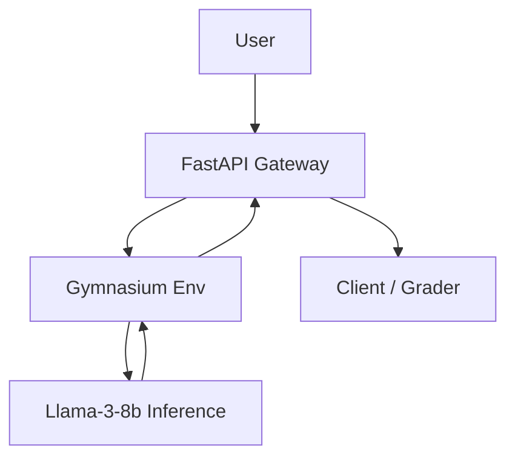

# 🤖 Sahayak AI: Autonomous RL Navigation System

## Project Overview
Sahayak AI is an autonomous Reinforcement Learning (RL) navigation system built for the Meta OpenEnv challenge. It pairs a custom Gymnasium environment with Meta's Llama-3-8b for high-level decision-making and is packaged as a Docker-ready Hugging Face Space.

## Technical Features
- Gymnasium-based custom environment.
- Full OpenEnv spec compliance: implemented `/state`, `/reset`, and `/step` endpoints.
- Meta Llama-3-8b inference integration for policy-level reasoning.
- Containerized deployment via Docker (ready for Hugging Face Spaces).

## Environment Specifications
- Observation Space: Box(0, 9, (2,), float32)
- Action Space: Discrete(4) — Up, Down, Left, Right
- Grid: 10x10 with level-based obstacle scaling
- Max Steps: 50
- Rewards: Success +1.0, Step penalty -0.1

## Tech Stack
- Backend: FastAPI, Uvicorn
- RL & Env: Gymnasium, NumPy
- LLM Inference: Meta Llama-3-8b (integration layer)
- DevOps: Docker, Hugging Face Spaces, GitHub

## Architecture

## OpenEnv Endpoints (implemented)
- `GET /state` — Current observation/state (OpenEnv-compliant)
- `POST /reset` — Reset environment and start new episode
- `POST /step` — Apply action, return next state/reward/done/info

## Docker & Deployment Notes
- The project includes a Dockerfile optimized for Python 3.10-slim and Hugging Face Spaces.
- Entrypoint runs a Uvicorn FastAPI server exposing the OpenEnv endpoints required for automated grading.

## Developers
- **Name:** Naorem Ngathoiba Singh
- **Role:** Software Product Engineering Student, Kalvium (Alliance University)
- **LinkedIn:** [https://www.linkedin.com/in/naoremnganthoiba]
- **GitHub:** [https://github.com/naormeit]
---
- **Name:** Raghav Duggal
- **Role:** Software Product Engineering Student, Kalvium (Alliance University)
- **LInkedIn:** [https://www.linkedin.com/in/raghav-duggal-b7508b37a/]
- **Github:** [https://github.com/Maverickrd007]
---
- **Name:** Kunal Yadav
- **Role:** Software Product Engineering Student, Kalvium (Alliance University)
- **LInkedIn:** [https://www.linkedin.com/in/kunalyadav69/]
- **Github:** [https://github.com/kunal9575]

---

